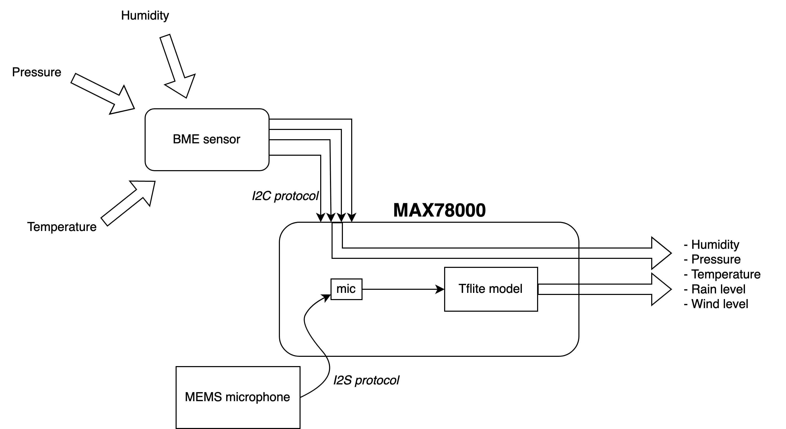

# TinyML Challenge 2022 - Team CSEM

## Description
This repository contains the code of the Team CSEM for the TinyML Challenge 2022. We designed Aurora, a low-cost, low-power, reliable, accurate, easy to install and maintain weather station without moving parts. To achieve this, we use microphone(s) as main sensor to detect the level of rain and the level of wind. Furthermore, we use an environmental sensor to track the temperature, humidity and pressure in the environment. We use the TinyML board [MAX78000FTHR](https://www.analog.com/en/design-center/evaluation-hardware-and-software/evaluation-boards-kits/max78000fthr.html) from Analog Devices as the heart of our Aurora weather station. 

The architecture of Aurora is depicted in the figure below: 

More detailed information about Aurora can be found in the report in this repository. 

## Code
The code in this repository is structured in the following way: 
- `Code/MAX78000FTHR`: folder containing firmware for MAX78000. This code is used for the real-world dataset acquisition and the ML inference on the embedded board. 
- `Code/sparkfun_weather_station`: folder containing the executable to acquire the rain and the wind of the Sparkfun weather station kit, used as the ground truth in our real-world dataset acquisition. 
- `Code/ml_training`: folder containing code to extract the acquired dataset, train the ML model and convert it for the deployment on the TinyML board MAX78000FTHR.

More detailed information can be found in the READMEs of the respective folders.

## Slides
The slides can be found in this repository under the name `TinyML_challenge_2022_CSEM_slides.pdf`. 

## Report
The report can be found in this repository under the name `TinyML_challenge_2022_CSEM_report.pdf`. 

## Dataset
The total acquired dataset has a size of around 40 GB. Due to this large size, we put part of this dataset (around 10 GB) on Google Drive, which can be found [here](https://drive.google.com/drive/folders/1BvVSgSlnqOhqWbyfZxKKtUl7gxiQA80P?usp=share_link).  

## Demo
Due the large size of the demo video, we put the demo on Google Drive, which can be found [here](https://drive.google.com/drive/folders/1BvVSgSlnqOhqWbyfZxKKtUl7gxiQA80P?usp=share_link).